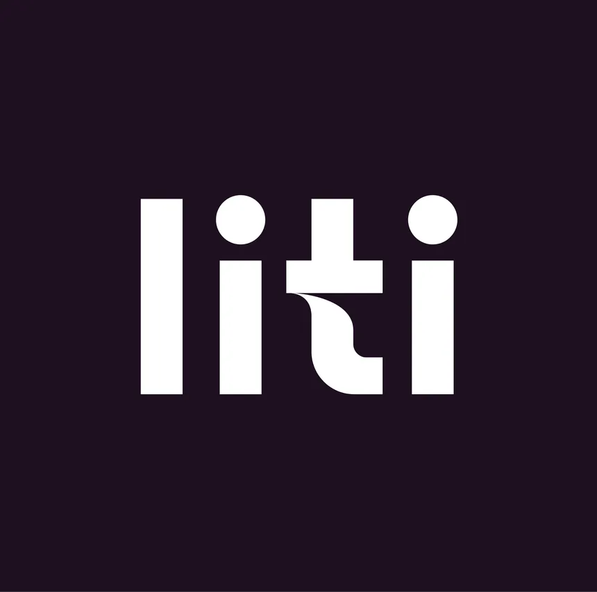

# Liti Saude Chat
&nbsp;&nbsp;&nbsp;&nbsp;Resolução de um case para o processo seletivo de estágio de férias na Liti Saude

## Quem é a Liti?
&nbsp;&nbsp;&nbsp;&nbsp;A Liti é uma empresa de tecnologia voltada para a área de saúde, que tem como objetivo ajudar as pessoas a ter uma vida mais saudável, fazendo isso por meio de consultas especializadas, relatórios e acompanhamentos específicos para cada cliente e um aplicativo que os guiará nesta jornada do autocuidado. 

   
   Figura 1 -Logo da Liti Saude 

    
   
   Fonte: <a href="https://www.liti.com.br/">https://www.liti.com.br/</a> (2024)
   

## Do que se trata o case?
&nbsp;&nbsp;&nbsp;&nbsp;Para este case, deve ser criado um produto que utilize de inteligência artificial e rode no Whatsapp, tendo conexão com a área de atuação da Liti.

## Solução proposta:
&nbsp;&nbsp;&nbsp;&nbsp;Um chatbot integrado com a API do Whatsapp e a API do ChatGPT que sirva como um modo para pessoas tirarem dúvidas rápidas relacionadas a saúde.  
&nbsp;&nbsp;&nbsp;&nbsp;O funcionamento seria um tanto simples: A pessoa contata o chatbot pelo whatsapp e faz uma pergunta em formato de texto. Essa pergunta é enviada ao ChatGPT, que então interpreta e devolve uma resposta para o usuário, tudo isso dentro do Whatsapp.

## Metrificação do sucesso da solução:
&nbsp;&nbsp;&nbsp;&nbsp;Uma maneira de metrificar o sucesso da solução é observar a quantidade de requests feita diariamente por diferentes clientes do chatbot, ou seja, quantos usuários estão utilizando a plataforma e quantas perguntas eles fazem. Além disso, podemos realizar observações e análises de dados para entender se um usuário, após usar a plataforma pela primeira vez, retorna novamente a ela no futuro. Por fim, no final do atendimento, a pessoa pode avaliar o chatbot por meio de um mecanismo de estrelas ou feedback escrito.

## O que essa solução NÃO é:
&nbsp;&nbsp;&nbsp;&nbsp;Essa solução, em nenhuma hipótese, é um substituto para médicos convencionais. Além disso, ela não deve ser usada para tirar dúvidas complexas ou se autodiagnosticar, visto que essas são incumbências de médicos de verdade. 

## Oportunidades identificadas:

* Usar GPT-4 para que ele possa fornecer fontes sobre as informações.

* Ao deixar o chatbot disponível para qualquer pessoa, essa pode ser uma maneira de novos clientes conhecerem a Liti e serem convertidos em usuários da empresa.

## Risco encontrado: 
* Cada requisição (pergunta) feita, custa uma pequena quantia para a pessoa que mantém a chave (no caso, seria a Liti). Pessoas mal intencionadas podem tentar enviar muitas perguntas ao mesmo tempo para dar prejuízo à Liti. 

    * Podemos contornar isso limitando a quantidade de perguntas que podem ser feitas ao chatbot por hora.

## Tecnologias utilizadas:
* Python 3
* Twilio: lidar com a api do whatsapp
* Flask: criar um servidor e fazer requisições http
* Openai: gerar respostas com chatgpt
* Figma
* API do Whatsapp
* API da OpenAI

## Mockups:
&nbsp;&nbsp;&nbsp;&nbsp;Não foi possível, de fato, rodar o programa e testar o chatbot por conta do custo que existe para se utilizar a API da OpenAI e do Whatsapp. Por conta disso, foi feito um mockup para demonstrar como a solução funcionaria.

   
   Figura 1 - Mockup da solução produzido no Figma 

    
   
   Fonte: Material produzido pelo autor (2024)
   

   
   Figura 1 - Mockup da solução produzido no Figma 

    
   
   Fonte: Material produzido pelo autor (2024)
   

## Links úteis:
Pasta no Drive com apresentação de slides em pdf e vídeo de apresentação:
<a href="https://drive.google.com/drive/folders/15QuDyEkgqIgIkZjJ4cPvxTbETFy9gBZ0?usp=sharing">https://drive.google.com/drive/folders/15QuDyEkgqIgIkZjJ4cPvxTbETFy9gBZ0?usp=sharing </a>  

Página no Notion:
<a href="https://cat-aftermath-452.notion.site/Case-Litti-a3875f6bcc784c62be93dac9bba7eb4c">https://cat-aftermath-452.notion.site/Case-Litti-a3875f6bcc784c62be93dac9bba7eb4c</a>

## Considerações finais:
&nbsp;&nbsp;&nbsp;&nbsp;Caso algum link/arquivo/imagem não esteja funcionando, me contate em caioalcantarasantos3@gmail.com